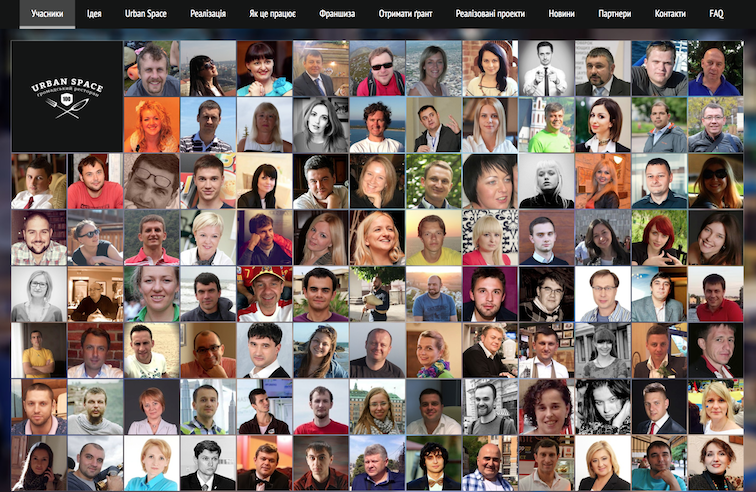

## Історія

27 грудня 2014 року в Івано-Франківську відкрився громадський ресторан [Urban Space 100](http://urbanspace.if.ua/uk). Його засновниками стали "100 соціально активних людей, яких об’єднує ідея якісного розвитку міського простору». Прибуток від діяльності ресторану спрямовується на фінансування міських проектів.

У вересні 2017 року Інститут соціально-економічної трансформації опублікував [дослідження](http://iset-ua.org/ua/novini/podatki/item/116-visim-skhem-ukhylennia-vid-podatkiv) «Порівняльний аналіз фіскального ефекту від застосування інструментів ухилення/уникнення оподаткування в Україні». На базі дослідження підготовлена інфографіка, яка швидко стала популярною серед користувачів Фейсбук. Дослідження та інфографіка наочно відображали той факт, що основною схемою ухилення від оподаткування в Україні є офшори. Зловживання зі спрощеною системою оподаткування на їх тлі є мізерними. Ці публікації стали вагомими аргументами в дискусії, що до змін в податковій системі.

## Ідея
Ідея полягає в тому, щоб започаткувати інкубатор соціальних ініціатив. Тобто організацію, яка буде допомагати окремим проектам пройти етап стартапу.

З цією метою організація утримує комунікаційні сервіси та інструменти спільної роботи у проектах. А головне - фінансує ініціативи протягом інкубаційного періоду.

Найближчими аналогами є:

- [Гурт](http://gurt.org.ua/) - портал підтримки громадських організацій,
- [Велика ідея](https://biggggidea.com/) - сервіс для краудфандингу, зокрема соціальних ініціатив.

## Іновація
Приклад дослідження ІСЕТ показує, що часом незначні ін'єкції можуть значно вплинути на суспільний дискурс. Складність полягає у виявлені точок докладання зусиль та знаходженні відповідних інструментів впливу. Вплив можна обґрунтувати та навіть виміряти, наприклад, через підходи [Теорії змін](https://en.wikipedia.org/wiki/Theory_of_change). Але залишається необхідність в експериментах для оцінки дієвості інструментів та тактик.

На відміну від Urban Space 100, де джерелом надходження коштів є господарська діяльність ресторану, передбачається формування фонду з членських внесків учасників організації. Отримані кошти розділяються на три частини - поточна діяльність організації, фінансування ініціатив, спільне фінансування великих проектів. Докладніше про алгоритм фінансування та приклад розрахунків на сторінці [Спільнокошт](http://tpd.withdraft.com/pages/1166629).
 
Новація полягає в тому, що **фінансування окремих ініціатив відбувається за згоди окремих членів організації**, без необхідності прийняття спільного рішення. Це відкриває можливість для ризикових інвестицій. З іншого боку модель передбачає спільне фінансування стратегічних проектів, зокрема тих, що пройшли через венчурне фінансування на попередньому етапі.

### Про проект
Ідея «підтримки соціальних ініціатив» є занадто загальною, щоб отримати масову підтримку. А без участі багатьох учасників організація не зможе стати фінансово потужною. 

Модель розповсюджується "з відкритим кодом" - будь яка інша організація може використати її. Але саме ця організація концентрується на питаннях розвитку МСБ в Україні. Це досягається в тому числі через вимоги до потенційних учасників. В першу чергу залучаються підприємці, власники діючого бізнесу.

### Як долучитись
- Підписатись на [тлог проекту](https://prostir.tumblr.com) та/або залишити відгук
- Запропонувати організації, з яких варто запросити підприємців
- Draft / StackEdit / GitHub - запропонувати зміни до цього сайту
- LeanStack - робота у стартапі

Суттєвою частиною проекту є використання інформаційних технологій, підходів зі світу open source та стартапів у суспільних проектах. Лог проекту за [посиланням](http://tpd.withdraft.com/pages/1193055).
<!--stackedit_data:
eyJoaXN0b3J5IjpbNzc1NDExMDk3XX0=
-->
